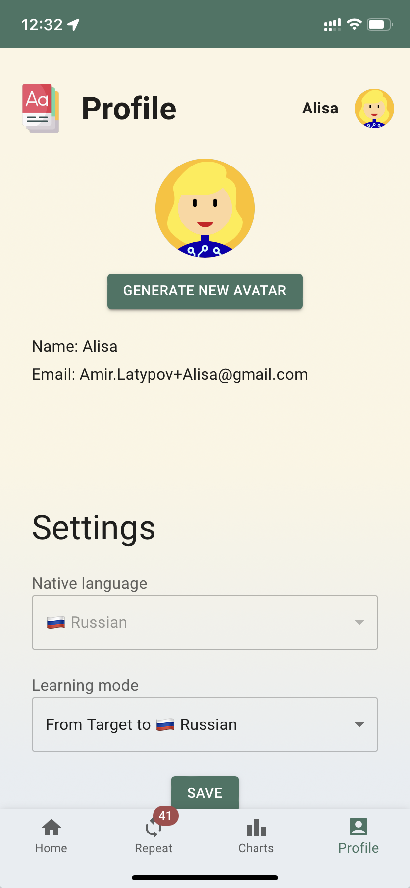

# MemoLang

A mobile-first Progressive Web Application. This flashcard app was created entirely by me and showcases my skills in modern frameworks.

- [Deployed on Vercel](https://turkish-learning.vercel.app/)

## Tech Stack

- Backend: Node.js, [Remix](https://remix.run/), (Serverless)
- Frontend: [React](https://react.dev/), [MUI](https://mui.com/)
- ORM: [Prisma](https://www.prisma.io/)
- Tests: [Vitest](https://vitest.dev/)
- DB: [Planetscale](https://planetscale.com/), MySql
- Host: [Vercel](https://vercel.com/)

## Screenshots

